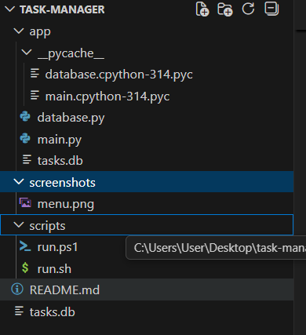
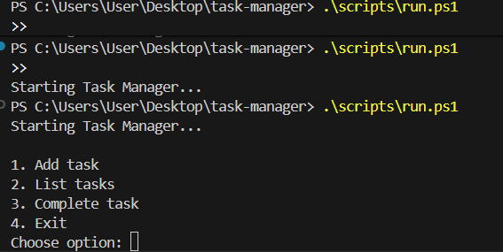

# Task Manager

  


## Описание
Task Manager е Python приложение за управление на задачи (Add/List/Complete).  
Използва SQLite база данни и работи през терминал.  
Менюто се върти непрекъснато, докато избереш Exit.

## Структура на проекта

task-manager/
├── app/
│ ├── main.py
│ └── database.py
├── scripts/
│ ├── run.ps1 # за Windows PowerShell
│ └── run.sh # за Git Bash / Linux
├── README.md
└── requirements.txt


## Стартиране

### Windows PowerShell
```powershell
cd C:\Users\User\Desktop\task-manager
.\scripts\run.ps1

Пример:

Starting Task Manager...

1. Add task
2. List tasks
3. Complete task
4. Exit
Choose option: 1
Task title: Run homework
Task added.

1. Add task
2. List tasks
3. Complete task
4. Exit
Choose option: 2
1. Run homework [TODO]

1. Add task
2. List tasks
3. Complete task
4. Exit
Choose option: 3
Task ID: 1
Task completed.

1. Add task
2. List tasks
3. Complete task
4. Exit
Choose option: 2
1. Run homework [DONE]